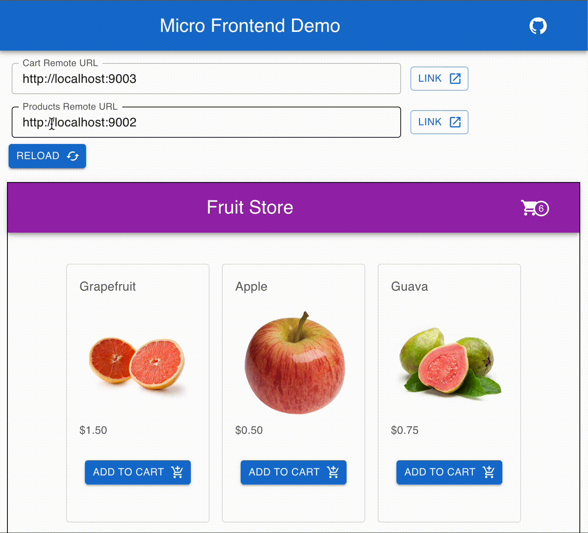

# Micro Frontend Demo

A sample repo for demoing a micro frontend architecture setup.



Live Example: [https://micro-frontend-demo-main.vercel.app/](https://micro-frontend-demo-main.vercel.app/)

## Getting started

1. Run: `yarn start`
2. Navigate to `http://localhost:9001/`

## Dynamic Remotes

We are taking advantage of Webpack Module Federation's [Dynamic Remote Containers](https://webpack.js.org/concepts/module-federation/#dynamic-remote-containers) to dynamically update the remote apps within a React micro frontend.

This works by injecting a script tag into the DOM to fetch the remote app at run time using the `fetchRemote` function found in: `main/src/utils/index.js`.

`RemoteComponent` is a React component we can re-use throughout our application to render modules from a remote app. It encapsulates:

- `ErrorBoundary` to safely render remote code without breaking our host app.
- Lazy loading using `React.Lazy` to fetch and resolve the remote code as needed without blocking the rest of our app rendering.
- Fetching and managing remote containers.

```javascript
<RemoteComponent
  // Text displayed while the component is being fetched
  fallback="Loading..."
  // Which remote to fetch the component from
  remote="RemoteApp"
  // Name of the React component exposed in our remote app
  module="HelloWorld"
/>
```

The implementation can be found in: `main/src/components/RemoteComponent/index.tsx`

Within the implementation we call a `loadComponent` function that acts as a middle man between the `RemoteComponent` and `fetchRemote` functions to manage our loaded remote containers.
