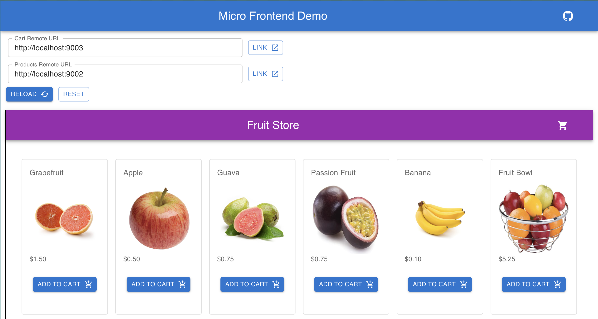

# Micro Frontend Demo

A project for demoing a micro frontend architecture in React with dynamic remote modules.

Check out the live version: [https://micro-frontend-demo-main.vercel.app/](https://micro-frontend-demo-main.vercel.app/)



## Getting started

1. Run: `yarn start`
2. Navigate to `http://localhost:9001/`

Main Host App: `http://localhost:9001/`
Products Remote: `http://localhost:9002/`
Cart Remote: `http://localhost:9003/`

## Demo

Once you have the local app running go to the live instance [https://micro-frontend-demo-main.vercel.app/](https://micro-frontend-demo-main.vercel.app/) and change the URLs for the Products or Cart remote to the localhost version. Make some code changes and watch as the production version of `main` reflects your local changes!

Of course, this is only visible to you but this pattern opens the door for a lot of interesting and helpful developer experiences.

## Dynamic Remotes

We are taking advantage of Webpack Module Federation's [Dynamic Remote Containers](https://webpack.js.org/concepts/module-federation/#dynamic-remote-containers) to dynamically update the remote apps within a React micro frontend.

This works by injecting a script tag into the DOM to fetch the remote app at run time using the fetchRemote function found in: `main/src/utils/index.js`

RemoteComponent is a React component we can re-use throughout our application to render modules from a remote app. It encapsulates:

ErrorBoundary to safely render remote code without breaking our host app.
Lazy loading using React.Lazy to fetch and resolve the remote code as needed without blocking the rest of our app rendering.
Fetching and managing remote containers.

```javascript
<RemoteComponent
  // Text displayed while the component is being fetched
  fallback="Loading..."
  // Which remote to fetch the component from
  remote="RemoteApp"
  // Name of the React component exposed in our remote app
  module="HelloWorld"
/>
```

The implementation can be found in: `main/src/components/RemoteComponent/index.tsx`

Within the implementation we call a loadComponent function that acts as a middle man between the RemoteComponent and fetchRemote functions to manage our loaded remote containers.

## Tech Stack

- [Turborepo](https://turborepo.org/)
- React
- Typescript
- Webpack v5 (w/ Module Federation)

## Iterations

- Dynamic remote containers: https://github.com/rautio/micro-frontend-demo/tree/dynamic-remote-react
- Zustand global state: https://github.com/rautio/micro-frontend-demo/tree/zustand-remote-state
- Deploy using environment variables: https://github.com/rautio/micro-frontend-demo/tree/env-variable-deploy

## Related Blog Posts

- How to use Webpack Module Federation in React: https://betterprogramming.pub/how-to-use-webpack-module-federation-in-react-70455086b2b0
- Zustand in a Micro Frontend: https://betterprogramming.pub/zustand-in-a-micro-frontend-b92d02a51577

### Rendering Remote React Components

To safely load react components you need an `ErrorBoundary` and should wrap the fetch logic within lazy loading and optionally use `React.Suspense` to render a friendly loading message.

```javacsript
const RemoteComponent = React.lazy(() => import("Remote/Component"));

export const App = () => (
  <ErrorBoundary>
    <React.Suspense fallback="Loading...">
      <RemoteComponent />
    </React.Suspense>
  </ErrorBoundary>
)

```
